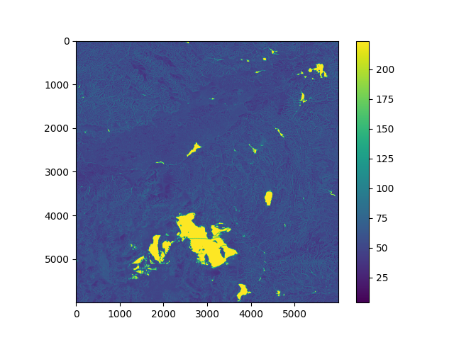

# CS5030 Final Project - Total Viewshed Computation
## Jeremy Young

***

Program to compute the total viewshed given a geographical dataset. Includes three parallel implementations:

* Shared using OpenMP
* GPU using CUDA
* Distributed using MPI

## Compilation instructions
### **Shared**

Required modules: `module load gcc/6`

Compile: `g++ -fopenmp -W -O3 -o main ./main.cpp`

Run: `./main`

### **Distributed**

Required modules: `module load gcc/6 openmpi`

Compile: `mpic++ -g -Wall -std=c++11 -o main ./main.cpp`

Run: `sbatch batch-<number of cores>.sh`

I have included slurm batch scripts for core counts 1, 4, 8, 16, 32, and 64.

### **GPU**

Required modules: `module load gcc/6 cuda/10`

Compile: `nvcc -o main ./main.cu`

Run: `./main`